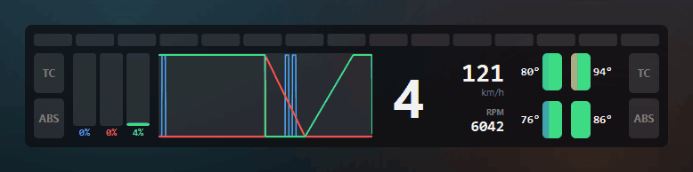
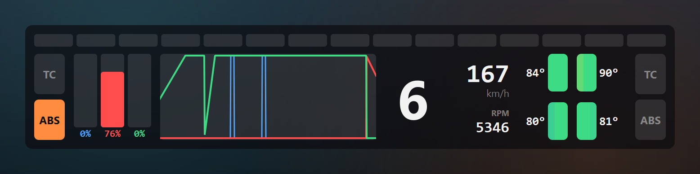
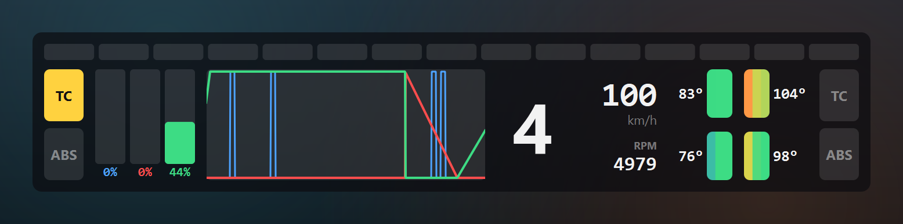
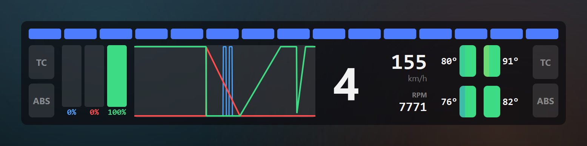
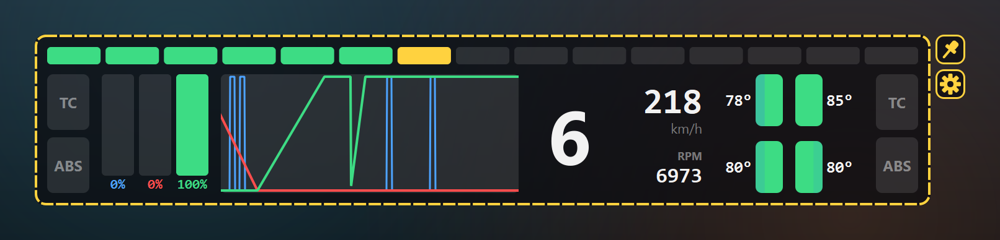
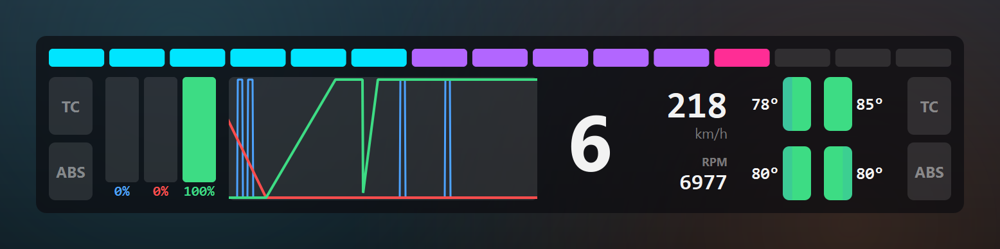
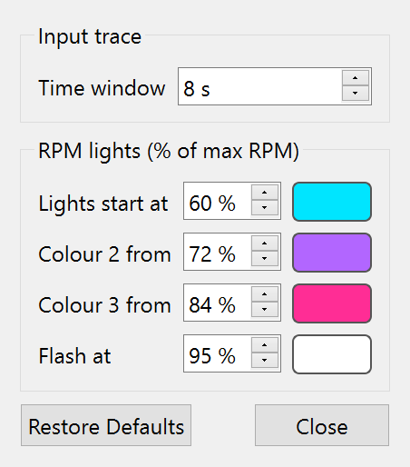

<h1 align="center">AC EVO Overlay</h1>

<p align="center">
  <strong>A lightweight, real-time telemetry overlay for Assetto Corsa EVO.</strong><br>
  Inputs, trace, shift lights, tyre temperatures and TC/ABS in one compact HUD that sits on top of the game.
</p>

<p align="center">
  
  
  
  
</p>

<p align="center">
  
  <br><sub>One demo lap: flat out down the straight, a trail-braked left-hander with ABS, and TC on the exit.</sub>
</p>

---

## Features

- **Pedal inputs.** Clutch, brake and throttle bars with the exact percentage under each.
- **Real-time input trace.** Scrolling throttle, brake and clutch history. The right edge is always
  your live input, and the time window (2–30 s) can be changed on the fly.
- **Shift lights.** A full-width, 15-light RPM strip with configurable colour zones and flash point.
- **Gear, speed and RPM** at a glance.
- **Tyre temperatures.** Each tyre shows inner, middle and outer surface temperatures as colour
  bands, with the average beside it, laid out like the car seen from above.
- **Side-aware TC and ABS lights.** Flashing lights on both sides of the HUD. The side that lights
  up is the side the system is working on.
- **Stays out of the way.** Always on top and click-through, so the mouse goes straight to the game.
  Pin it in place, or unpin it and drag it anywhere.
- **Portable.** A single folder with no installer, no game files touched, and settings saved next
  to the app.

## Screenshots

<table>
  <tr>
    <td width="50%">
      
      <p align="center"><sub><b>Trail braking into a left-hander.</b> ABS lights on the inside (left), where the unloaded wheels lock first.</sub></p>
    </td>
    <td width="50%">
      
      <p align="center"><sub><b>Corner exit.</b> TC cuts in on the inside rear, and the right-side tyres show the heat from the corner.</sub></p>
    </td>
  </tr>
  <tr>
    <td width="50%">
      
      <p align="center"><sub><b>Shift point.</b> The whole strip flashes when RPM reaches the flash threshold.</sub></p>
    </td>
    <td width="50%">
      
      <p align="center"><sub><b>Move mode.</b> Unpin to drag the overlay anywhere, then pin to lock it in place.</sub></p>
    </td>
  </tr>
  <tr>
    <td width="50%">
      
      <p align="center"><sub><b>Your colours.</b> RPM light zones and colours are fully configurable.</sub></p>
    </td>
    <td width="50%" align="center">
      
      <p align="center"><sub><b>Settings.</b> Changes apply live and are saved automatically.</sub></p>
    </td>
  </tr>
</table>

## Getting started

### Requirements

- Windows 10 or 11
- Assetto Corsa EVO set to **borderless** or **windowed** display mode. No overlay can draw on
  top of exclusive fullscreen, and VR isn't supported.

### Portable package (no install)

Build the self-contained package (see [Development](#development)), or grab a prebuilt
`ace-overlay-<version>-win64.zip`. Then:

1. Extract the zip anywhere and open the `ace-overlay` folder.
2. Double-click **`ace-overlay.exe`**.
3. Start a session in AC EVO. The overlay shows *Waiting for Assetto Corsa EVO…* until you're on
   track, then comes alive. It can be started before or after the game.

> **Windows SmartScreen:** the app isn't code-signed, so Windows may say *"Windows protected your
> PC"* the first time. Click **More info → Run anyway**.

### From source

```bash
git clone https://github.com/blueratdota/ace-overlay.git
cd ace-overlay
python -m venv .venv
.venv\Scripts\pip install -e .
.venv\Scripts\pythonw -m ace_overlay
```

## Using the overlay

| Control | What it does |
| --- | --- |
| 📌 **Pin** (right of the overlay) | Click to unpin, drag the overlay into place, then click again to lock it. When locked, clicks pass through to the game. The position is remembered. |
| ⚙️ **Gear** (under the pin) | Opens the settings window. |
| **Tray icon** | Right-click for *Move overlay*, *Settings…* and *Quit*. |

The pin and gear fade out while you drive and light up when you hover over them.

### Settings

| Setting | Default | Description |
| --- | --- | --- |
| Input trace time window | 8 s | How much history the trace shows (2–30 s). Longer means slower scrolling. The whole trace rescales instantly. |
| Lights start at | 80 % | RPM (as % of max) where the first shift light comes on. The lights spread evenly from here to the flash point. |
| Colour 2 from / Colour 3 from | 86 % / 92 % | Where each light switches colour. Every light takes the colour of the RPM % it represents. |
| Flash at | 97 % | RPM where the whole strip flashes. |
| Colours | green / yellow / red / blue | One swatch per zone plus the flash colour. |

### Reading the tyres

Each tyre is split into three bands (outer, middle, inner), with the outer band on the outside of
the car. The number is the average surface temperature.

| Colour | Surface temperature |
| --- | --- |
| 🟦 Blue | Cold, 50 °C and below |
| 🟩 Green | Optimal window, 75–95 °C |
| 🟨 Yellow | Getting hot, around 105 °C |
| 🟥 Red | Overheating, 115 °C and above |

The window suits typical racing slicks. Adjust `TYRE_STOPS` in
[`ace_overlay/overlay.py`](ace_overlay/overlay.py) for other compounds.

## How it works

AC EVO publishes live telemetry through Windows named shared memory (`Local\acevo_pmf_physics`).
This is the same official interface dashboards and tools like SimHub use. The overlay opens that
block **read-only** about 60 times a second and draws it in a transparent, always-on-top window.
It never modifies game files and never injects into the game process.

```
AC EVO ──writes──▶ Local\acevo_pmf_physics (800-byte struct) ──read-only──▶ ace-overlay ──▶ transparent HUD
```

### Good to know

- **Tyre wear isn't shown.** AC EVO doesn't publish it. The in-game HUD calculates it internally
  and never writes it to shared memory.
- **The TC/ABS side is inferred.** The game reports TC and ABS as single on/off flags. The overlay
  picks the side from per-wheel slip, and lights both sides when they're close or when no slip data
  is available.
- **Early access.** AC EVO is still in development and Kunos can change the telemetry layout
  between patches. If values look wrong after an update, run **`Check telemetry.bat`** (or
  `python -m ace_overlay --dump`) while driving and compare against the in-game HUD, then
  [open an issue](https://github.com/blueratdota/ace-overlay/issues).

## Development

```bash
.venv\Scripts\pip install -e .[build,dev]

.venv\Scripts\python -m ace_overlay --demo        # overlay with simulated telemetry, no game needed
.venv\Scripts\python -m ace_overlay --dump        # print live telemetry to the console
.venv\Scripts\python -m unittest discover -s tests
.venv\Scripts\python tools\screenshots.py         # regenerate the images in docs/images
.venv\Scripts\python build.py                     # build dist/ace-overlay-<version>-win64.zip
```

The demo mode drives a repeating 10-second lap, so every part of the HUD can be worked on without
the game running. `build.py` packages the app with PyInstaller, strips unused Qt modules, and zips
a portable folder with a user-facing `README.txt` and `Check telemetry.bat`.

### Project layout

```
ace_overlay/
├── shm.py        # read-only shared-memory reader and the 800-byte physics struct
├── overlay.py    # the HUD window, plus pin and settings buttons
├── config.py     # user settings (QSettings) and the settings window
├── demo.py       # simulated telemetry lap for development
└── app.py        # entry point: CLI flags, tray icon, portable-mode settings
packaging/        # PyInstaller launcher and files shipped in the zip
tools/            # screenshot / GIF generator
tests/            # struct layout tests pinning every documented offset
build.py          # portable package builder
```

## Acknowledgements

- Kunos Simulazioni's official
  [AC EVO shared memory documentation](https://steamcommunity.com/sharedfiles/filedetails/?id=3707421508).
- [live-telemetry-evo](https://github.com/albertowd/live-telemetry-evo) for its detailed
  field-by-field
  [shared memory reference](https://github.com/albertowd/live-telemetry-evo/blob/develop/docs/SHARED_MEMORY.md).

## Disclaimer

This is an independent community project. It isn't affiliated with or endorsed by Kunos
Simulazioni. *Assetto Corsa* is a trademark of its respective owner.
